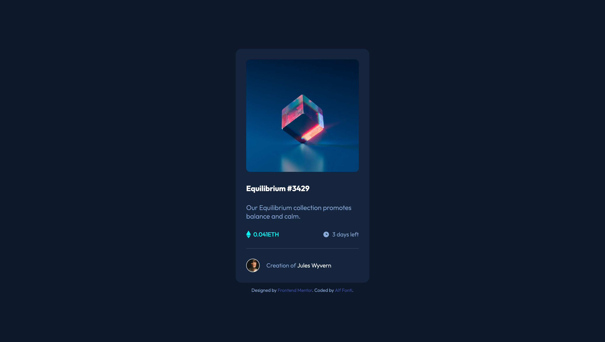

# Frontend Mentor - NFT preview card component solution

This is a solution to the [NFT preview card component challenge on Frontend Mentor](https://www.frontendmentor.io/challenges/nft-preview-card-component-SbdUL_w0U). Frontend Mentor challenges help you improve your coding skills by building realistic projects. 

## Table of contents

- [Overview](#overview)
  - [The challenge](#the-challenge)
  - [Screenshot](#screenshot)
  - [Links](#links)
- [My process](#my-process)
  - [Built with](#built-with)
  - [What I learned](#what-i-learned)
  - [Continued development](#continued-development)
  - [Useful resources](#useful-resources)
- [Author](#author)
- [Acknowledgments](#acknowledgments)

## Overview

### The challenge

Users should be able to:

- View the optimal layout depending on their device's screen size
- See hover states for interactive elements

### Screenshot



### Links

- Solution URL: [GitHub](https://github.com/Alffonti/nft-preview-card-component)
- Live Site URL: [Netlify](https://nft-preview-card-component-by-alf.netlify.app/)

## My process

### Built with

- Semantic HTML5 markup
- CSS custom properties
- Flexbox
- CSS Grid
- Mobile-first workflow
- [React](https://reactjs.org/) - JS library

### What I learned

I used the `transparentize()` color function to decrease the alpha channel of the overlay background. [[1](https://sass-lang.com/documentation/modules/color#transparentize)]

```scss
.overlay {
  background-color: transparentize($color: $cyan, $amount: 0.5);
}
```

### Useful resources

- [Data fetching](https://reactjs.org/docs/testing-recipes.html#data-fetching)
- [Most commonly used patterns to fetch data with React](https://www.freecodecamp.org/news/fetch-data-react/) - There are many ways to fetch data from an external API in React.
- [Manipulating Sass Colors With HSL And Opacity Functions](https://vanseodesign.com/css/sass-colors-part-2/)
- [How TO - Image Overlay Icon](https://www.w3schools.com/howto/howto_css_image_overlay_icon.asp)

## Author

- Website - [alffonti.netlify.app](https://alffonti.netlify.app/)
- Frontend Mentor - [@alffonti](https://www.frontendmentor.io/profile/Alffonti)
- Twitter - [@alphfonti](https://twitter.com/alphfonti)

## Acknowledgments

- [Nathaniel Adiah](https://github.com/adiah-frontend-mentor)
